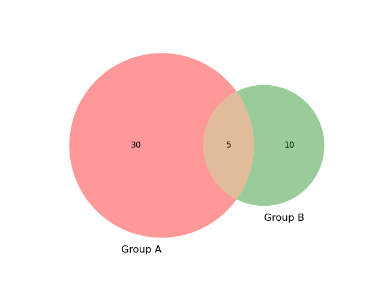
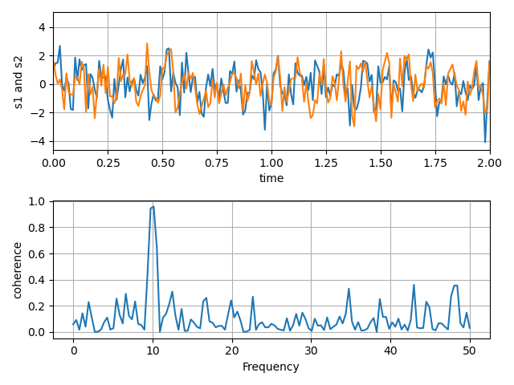

# pandoc-run-filter

A simple pandoc filter that runs an embedded command or script in a markdown document capturing its output as an image or text.

This tool has two basic use cases:

1. Execute a program or command as specified in the markdown
2. Execute a script that you embed in the markdown itself

The tool then captures the output and passes it to *pandoc* as either:

1. Text
2. Image

So what could go wrong?

```
 /\  /\ !!!!!!!!! /\  /\
|! ||! |!!!!!!!!!|! ||! |
|! ||! |         |! ||! |
|! ||! | Warning |! ||! |
|! ||! |         |! ||! |
|__||__|!!!!!!!!!|__||__|
(__)(__)!!!!!!!!!(__)(__)
```

***Warning: Only run this tool on markdown content that you trust. Don't blindly run it on unverified content since inputs are executed while running pandoc.***

```
 /\  /\ !!!!!!!!! /\  /\
|! ||! |!!!!!!!!!|! ||! |
|! ||! |         |! ||! |
|! ||! | Warning |! ||! |
|! ||! |         |! ||! |
|__||__|!!!!!!!!!|__||__|
(__)(__)!!!!!!!!!(__)(__)
```

## Installation

```bash
$ pip install -e .
```

## Test

```bash
$ pip install -e .[dev]
$ pytest ./tests/tests.py
```

## Execution

```bash
$ pandoc --filter pandoc-run-filter myfile.md -o myfile.epub
```

## Uninstallation

```bash
$ pip uninstall pandoc-run-filter -y
```

## Markdown Options

pandoc-run-filter looks for the following syntax in a markdown file where *.run* is the keyword.

``````
```{.run cmd="?" in="?" out="?"}
?
```
``````

Some examples of *cmd* might include:

* echo
* python
* dir
* ls
* myprogram
* /home/user/myprogram
* ../../myprogram
* ...

Next, the *in* parameter tells us how *cmd* should be executed. We have two options here:

Run as a shell command:

```bash
in="shell"
```

Run as a script:

```bash
in="script"
```

Next, the *out* parameter tells us how the output should be handled. We have two options here as well:

Capture as text:

```bash
out="text"
```

Capture as an image:

```bash
out="image"
```

If the *out* is an image and what gets executed generates a image file, then we can use the optional *img* parameter to point to the path of that file. If this option is not provided, then the tool will convert the text output to an image.

```bash
out="image" img="<path>"
```

That's about it. Now, it's time for some examples. There were taken from the use cases under the *./tests* directory.


## Examples

### ./tests/01.md

*Run the echo command in a shell and capture the output as text*

Markdown:

``````
```{.run cmd="echo" in="shell" out="text"}
'This is output as text.'
```
``````

Output:

```bash
'This is output as text.'
```

### ./tests/02.md

*Run the echo command in a shell and capture the output as an image*

Markdown:

``````
```{.run cmd="echo" in="shell" out="image"}
'This is output as text.'
```
``````

Output:


### ./tests/03.md

*Run embedded python script and capture the output as text*

Markdown:

``````
```{.run cmd="python" in="script" out="text"}
import random
r = random.randint(0,101)
print(f'''Here's a random number between 0-100: {r}''')
```
``````

Output:

```bash
Here's a random number between 0-100: 64
```

### ./tests/04.md

*Run embedded python script and capture the output as a path to an image it created*

Markdown:

``````
```{.run cmd="python" in="script" out="image" img="04.png"}
from matplotlib_venn import venn2, venn2_circles, venn2_unweighted
from matplotlib_venn import venn3, venn3_circles
from matplotlib import pyplot as plt
venn2(subsets = (30, 10, 5), set_labels = ('Group A', 'Group B'))
plt.sa
```
``````

Output:




### ./tests/05.md

*Run embedded python script and capture the output as a path to an image it created*

Markdown:

[Credit: Matplotlib](https://matplotlib.org/3.1.1/gallery/lines_bars_and_markers/cohere.html)

``````
```{.run cmd="python" in="script" out="image" img="05.png"}
import numpy as np
import matplotlib.pyplot as plt

# Fixing random state for reproducibility
np.random.seed(19680801)

dt = 0.01
t = np.arange(0, 30, dt)
nse1 = np.random.randn(len(t)) # white noise 1
nse2 = np.random.randn(len(t)) # white noise 2

# Two signals with a coherent part at 10Hz and a random part
s1 = np.sin(2 * np.pi * 10 * t) + nse1
s2 = np.sin(2 * np.pi * 10 * t) + nse2

fig, axs = plt.subplots(2, 1)
axs[0].plot(t, s1, t, s2)
axs[0].set_xlim(0, 2)
axs[0].set_xlabel('time')
axs[0].set_ylabel('s1 and s2')
axs[0].grid(True)

cxy, f = axs[1].cohere(s1, s2, 256, 1. / dt)
axs[1].set_ylabel('coherence')

fig.tight_layout()
plt.savefig("05.png")
```
``````

Output:



